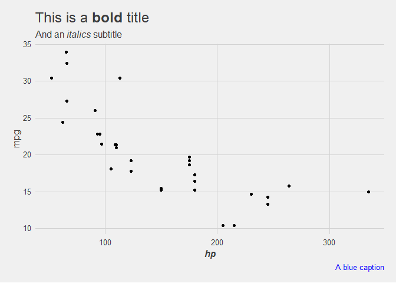

mdthemes
================

[](https://github.com/thomas-neitmann/mdthemes/actions)

## Overview

`{mdthemes}` adds support for rendering text as markdown to your
favorite `{ggplot2}` themes thanks to the awesome `{ggtext}` package.

## Installation

The package is available from CRAN.

``` r
install.packages("mdthemes")
```

Alternatively, you can install the latest development version from
GitHub.

``` r
if (!requireNamespace("remotes", quietly = TRUE)) {
  install.packages("remotes")
}
remotes::install_github("thomas-neitmann/mdthemes", upgrade = "never")
```

## Usage

Currently, `{mdthemes}` contains all themes from `{ggplot2}`,
`{ggthemes}`, `{hrbrthemes}`, `{tvthemes}` and `{cowplot}` with support
for rendering text as markdown. All themes start with `md_` followed by
the name of the original theme, e.g. `md_theme_bw()`.

``` r
library(ggplot2)
library(mdthemes)
data(mtcars)

p <- ggplot(mtcars, aes(hp, mpg)) +
  geom_point() +
  labs(
    title = "This is a **bold** title",
    subtitle = "And an *italics* subtitle",
    x = "**_hp_**",
    caption = "<span style = 'color:blue'>A blue caption</span>"
  )

p + theme_minimal()
p + md_theme_minimal()
```


``` r
p + ggthemes::theme_fivethirtyeight()
p + md_theme_fivethirtyeight()
```


